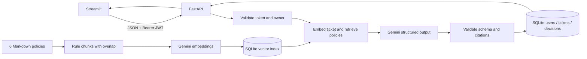

# ◈ Policy Desk

[](https://github.com/Teja2000-byte/policy-desk/actions/workflows/tests.yml)

**An authenticated support-ticket assistant that explains its recommendations with policy evidence.**

Streamlit → HTTP → FastAPI → local retrieval → Gemini → validated decision → SQLite.

Built for the MaxsorLabs AI & Backend Engineering Internship assessment. The six supplied policy files are the source of truth. Historical ticket labels are never used to answer a new ticket. Recommendations require human review; the application does not execute refunds, replacements, or customer communications.

## Quick start

Use **Python 3.12**. Clone the repository, then run:

```bash
git clone https://github.com/Teja2000-byte/policy-desk.git
cd policy-desk
python3.12 -m venv .venv
source .venv/bin/activate
python -m pip install -r requirements-dev.txt
python scripts/setup.py
python run.py
```

On Windows, activate with `.venv\Scripts\activate` instead. For running without tests, install `requirements.txt`.

The setup script asks for your **own Gemini API key** with hidden input and generates a random JWT signing secret. Create a key in [Google AI Studio](https://aistudio.google.com/api-keys). The private `.env` is ignored by Git. Do not put keys in Streamlit, source files, shell command arguments, screenshots, or recordings.

If `.env` already exists, use `python scripts/setup.py --set-key` to enter the key privately without replacing your JWT secret, then restart the backend.

Open **[the app](http://127.0.0.1:8501)** and **[interactive API docs](http://127.0.0.1:8000/docs)**. `Ctrl+C` stops both services. The app runs on localhost only.

Keep the terminal running while using the application. If the browser reports **"site cannot be reached"**, start `python run.py` again and reload the page. The local URL is not a hosted public website and will be unavailable after the server stops or the computer shuts down. This is separate from a Gemini quota error, which appears inside the running app.

1. Create an account, or sign in.
2. Choose **New decision**, enter a ticket and known order facts, then generate.
3. Review the action, reason, confidence, follow-up questions, and exact policy quotes.
4. Open **History** and choose a saved ticket. Its complete customer message and all six submitted order fields are visible above the recommendation, with missing values clearly labeled. You can also download the complete JSON record.

The first decision builds the policy index. To prepare it before a demo:

```bash
python -m scripts.ingest
```

Without a Gemini key, registration, login, and empty history work; decision generation returns an explicit setup error. **There is no fake/offline decision mode.** Automated tests use isolated test doubles and do not measure Gemini accuracy.

## Verification and evaluation

Verified on **17 September 2026**, using the final **Gemini 3.5 Flash-Lite** configuration:

| Check | Result | Evidence |
|---|---|---|
| Supplied cases, real Gemini | **5 correct / 5 total; 0 incorrect; 0 errors; 100% accuracy on this set** | [Current evaluation](reports/evaluation-current.json) |
| Missing-information case S05 | `NEEDS_MORE_INFORMATION`, with specific customer questions | Included in the same five-case run |
| Offline engineering tests | **110 passed; 99.01% `src/` statement coverage** | [Verification record](reports/verification.md) |
| Data and policies | All nine supplied files unchanged | Byte-for-byte comparison with the candidate pack |

The live evaluation used **11 API requests**, below the approved cap of 30, and saved all five tickets and validated decisions. This is **accuracy on five visible supplied cases**, not a claim of 100% accuracy on unseen tickets. Confidence displayed in the UI is a separate, uncalibrated model estimate.

[GitHub Actions](https://github.com/Teja2000-byte/policy-desk/actions/workflows/tests.yml) runs the offline suite and code checks without a Gemini key. Historical **5/5 supplied-case** and **12/12 additional-case** runs used Gemini 2.5 Flash and an earlier prompt; they are preserved separately and are not scores for the current model.

```bash
# Offline engineering tests: no API key or paid model calls
python -m pytest --cov=src --cov-report=term-missing
python -m ruff check .

# Live evaluation: keep the backend running; uses your Gemini quota
python -m scripts.evaluate --output reports/evaluation-local.json --delay 15

# The 12 preselected cases used in the recorded boundary run
python -m scripts.evaluate --cases data/boundary_smoke_cases.json --output reports/boundary-local.json --delay 20

# All 40 additional cases (not all were executed in the recorded run)
python -m scripts.evaluate --cases data/extended_test_cases.json --output reports/extended-evaluation.json

# Optional diagnostic run on the 214 historical tickets
python -m scripts.evaluate --cases data/tickets.csv --limit 20 --output reports/historical-diagnostic.json
```

The live runner creates an isolated evaluation account, registers and logs in over HTTP, sends tickets to `POST /tickets`, and saves the actual outcomes. Only fields declared by `TicketInput` are transmitted. `expected_action`, `resolved_action`, `issue_type`, customer identifiers, and names are excluded. Evaluation accounts and their tickets remain in the local database; credentials are generated in memory and not reported.

Reports show total, correct, incorrect, errors, accuracy, per-case outcomes, model, dataset hash, and policy version. Accuracy is **correct / all cases**, including service failures in the denominator. A missing key stops evaluation with **NOT RUN** and no claimed score. The supplied five cases are a smoke test, not a generalization benchmark. Historical labels may be less specific than policy prose; inspect discrepancies instead of copying labels into inference.

See [verification status](reports/verification.md) for what was actually run, and [the requirement checklist](docs/REQUIREMENTS.md) for coverage of the brief.

The [verification record](reports/verification.md) separates the final result from historical evaluations and unsuccessful provider diagnostics. All saved reports retain their actual model names and outcomes.

When `GEMINI_MODEL` selects Gemini 3.x, generation uses a low thinking level and leaves temperature at the provider default. Other models retain temperature 0.

## Gemini quota troubleshooting

If a decision fails with a daily-quota message, wait for the daily reset at midnight Pacific Time. The key can be valid while generation quota is exhausted. The app preserves existing history and does not save a failed decision. It does not immediately retry HTTP 429; network/server failures retain one bounded retry. Check your project's active limits in [Google AI Studio](https://aistudio.google.com/usage?tab=rate-limit); limits vary by model and project.

Provider failures show the failed step and Google HTTP status, with fixed guidance for rejected keys, permissions, missing models, quota, and server outages. Raw provider responses, credentials, and ticket text are never included in these messages or diagnostic logs. A configured key in `/health` confirms local setup only; it does not verify access to Gemini. When Google reports high demand, the app explains that the model is busy and preserves saved History.

Provider access and quota depend on your own project and selected model. A different API key in the same project does not create an independent project quota. See [Google's rate-limit documentation](https://ai.google.dev/gemini-api/docs/rate-limits).

## How the pipeline works



**Retrieval.** Each policy is split at complete numbered rules, targeting 420 characters, with the title repeated and one-rule overlap where possible. A single long rule can exceed the target rather than being cut in half. Gemini `gemini-embedding-001` creates 768-dimensional vectors, which are normalized and stored as float32 BLOBs in SQLite. The incoming ticket uses `RETRIEVAL_QUERY`; policy chunks use `RETRIEVAL_DOCUMENT`. NumPy dot products on normalized vectors yield cosine similarity. Rank chunks, choose the best three distinct policy documents, then include all chunks from those parents to preserve eligibility windows and exceptions. This is small-corpus RAG with bounded parent expansion, not a hosted vector database.

**Index lifecycle.** A SHA-256 fingerprint includes the policy contents, filenames, embedding model, dimensions, and chunk configuration. Unchanged indexes are reused across restarts. A changed index is built before it atomically replaces the old one. Run `python -m scripts.ingest --force` to rebuild explicitly. Historical CSV files are not ingested.

**Decision.** Gemini receives only the current ticket and retrieved policy chunks, with a fixed system instruction and JSON schema. Pydantic validates the action enum, bounded finite confidence, reason, evidence, and clarification questions. The server checks each cited chunk ID and quote against the retrieved text and requires the source list to match the evidence. Invalid output gets one repair attempt; otherwise the API returns 502 and saves nothing. Missing facts are a valid `NEEDS_MORE_INFORMATION` decision. A provider outage is 503, not a business recommendation.

**Persistence.** A successful ticket and its validated decision are saved in one SQLite transaction. The record preserves submitted metadata, retrieved text, citations, model name, policy fingerprint, and elapsed decision time. Historical results therefore retain the evidence used at creation even if policies change later.

## API

All request bodies are JSON. Protected routes require `Authorization: Bearer <JWT>`.

| Method | Route | Purpose |
|---|---|---|
| POST | `/register` | Create an account; returns 201 |
| POST | `/login` | Verify credentials and issue an expiring JWT |
| GET | `/me` | Return the authenticated account |
| POST | `/tickets` | Generate, validate, and persist a decision; returns 201 |
| GET | `/tickets?limit=20&offset=0` | Account-scoped history, newest first |
| GET | `/tickets/{ticket_id}` | Account-scoped ticket and decision |
| GET | `/health` | Service/configuration/index status; does not test Gemini connectivity |

Example ticket body:

```json
{
  "message": "My ₹3,500 order arrived damaged yesterday.",
  "order_value_inr": 3500,
  "days_since_delivery": 1,
  "days_since_dispatch": null,
  "product_type": "non_food",
  "opened_status": "opened",
  "order_status": "delivered"
}
```

Days are nonnegative integers; unknown numeric values are `null`, never fabricated as zero. `processing` and `not_dispatched` mean pre-dispatch. Other order statuses: `dispatched`, `delivered`, `unknown`. The model can use precise facts in the message when a structured field is unknown; conflicting explicit facts require clarification.

Error responses use `{"detail": "..."}` (FastAPI validation errors use a structured list). Status codes: 401 missing/invalid/expired authentication, 404 missing or inaccessible ticket, 409 duplicate email, 422 invalid input, 502 invalid AI result, 503 provider/configuration failure. The API returns the same 404 for a nonexistent ticket and someone else's ticket.

## Security and engineering choices

- Argon2id password hashes through `pwdlib`; no plaintext password storage.
- Signed HS256 JWTs with expiration, issued-at time, issuer, audience, and string user ID. The accepted algorithm is fixed by the server.
- Every ticket query includes the authenticated user ID. The client cannot choose its owner.
- Parameterized SQL, foreign keys, a unique decision per ticket, JSON constraints, and a confidence range constraint. See [schema.sql](docs/schema.sql).
- Streamlit accesses application data exclusively over HTTP and holds the token only in its session. Sign-out and expired sessions clear private UI state.
- Gemini credentials live on the backend. Provider error bodies and keys are not exposed in client-facing errors.
- Minimal dependencies: standard-library `sqlite3`, NumPy, Pydantic, and the official Google Gen AI SDK. No ORM, agent orchestration, or external vector store is needed for six policies.

## Configuration

| Variable | Default / purpose |
|---|---|
| `GEMINI_API_KEY` | Your own key; required for embeddings and decisions |
| `JWT_SECRET` | Required random value, at least 32 characters; generated by setup |
| `GEMINI_MODEL` | `gemini-3.5-flash-lite` |
| `EMBEDDING_MODEL` | `gemini-embedding-001`; this adapter uses its task-type semantics |
| `EMBEDDING_DIMENSIONS` | `768` |
| `JWT_EXPIRY_MINUTES` | `60` |
| `RETRIEVAL_DOCUMENTS` | `3` |
| `PROVIDER_TIMEOUT_SECONDS` | `30` per provider attempt |
| `DATABASE_PATH` | Project-local `storage/app.db` |
| `KNOWLEDGE_BASE_PATH` | Project-local `knowledge_base/` |
| `API_BASE_URL` | Streamlit process environment; default `http://127.0.0.1:8000` |

Restart the backend after changing `.env`. Model access and quotas vary by account. Do not switch the embedding model to a model with different task-type/input semantics without adapting `src/provider.py` and rebuilding the index.

To run the services separately, use two terminals from the project directory:

```bash
python -m uvicorn src.api:create_app --factory --host 127.0.0.1 --port 8000
python -m streamlit run streamlit_app.py --server.port 8501
```

## Repository map

```text
src/api.py          Routes and request lifecycle
src/auth.py         Password verification and JWT handling
src/database.py     Schema, transactions, and owner-scoped queries
src/retrieval.py    Policy ingestion, local index, cosine retrieval
src/provider.py     Gemini SDK, timeouts, bounded retries
src/decision.py     Prompt, structured validation, citation checks
src/schemas.py      Request/response contracts and action vocabulary
src/ui_client.py    HTTP-only frontend API client
streamlit_app.py    Account, new decision, and history screens
scripts/           Safe setup, ingestion, evaluation, packaging
tests/             Offline automated engineering checks
knowledge_base/    The six original policies, unchanged
data/              Original historical tickets and additional evaluation cases
docs/              Requirements, schema, study guide, and demo script
reports/           Verification record and live evaluation outputs
DEVELOPMENT.md     Honest AI coding-agent disclosure
```

## Limits and next steps

This is a small local assessment, not a production deployment. Exact citations prove that quoted text exists, **not that the model interpreted it correctly**. Confidence is self-reported and uncalibrated. Prompt injection is addressed in prompt construction but not guaranteed to be defeated. More evaluation on unseen cases and human review remain necessary.

There is no password reset, refresh-token/revocation store, distributed index coordination, rate limiter, migration framework, streaming result, or idempotency key. A client timeout followed by a retry can create a duplicate if the original request completed. The launcher runs one backend process; do not edit policies while requests are in flight. HTTPS, rate limiting, observability, migrations, token revocation, and idempotency would be priorities for deployment beyond localhost.

The evidence check permits whitespace-normalized exact excerpts, not arbitrary paraphrases. `NEEDS_MORE_INFORMATION` may cite no policy when the ticket is outside the available knowledge. The action `APPROVE_REFUND` covers the wrong-item policy's explicitly unavailable original item, although that label does not appear in the supplied historical CSV.

## Review and demonstration

- [Study guide and technical discussion preparation](docs/STUDY_GUIDE.md)
- [Under-two-minute demo script](docs/DEMO_SCRIPT.md)
- [Submission checklist](docs/SUBMISSION_CHECKLIST.md)
- [AI-assisted development disclosure](DEVELOPMENT.md)

Technical references: [Google Gen AI Python SDK](https://googleapis.github.io/python-genai/), [Gemini structured outputs](https://ai.google.dev/gemini-api/docs/structured-output), [Gemini embeddings](https://ai.google.dev/gemini-api/docs/embeddings). The implementation uses the SDK's `models.generate_content` API and validates the returned JSON independently.

The narrated Streamlit demonstration accompanies the submission through Google Drive. It shows sign-in, a real generated recommendation with evidence, and saved History including a clarification result. No public application deployment is required; reviewers run the project locally with their own credentials.
